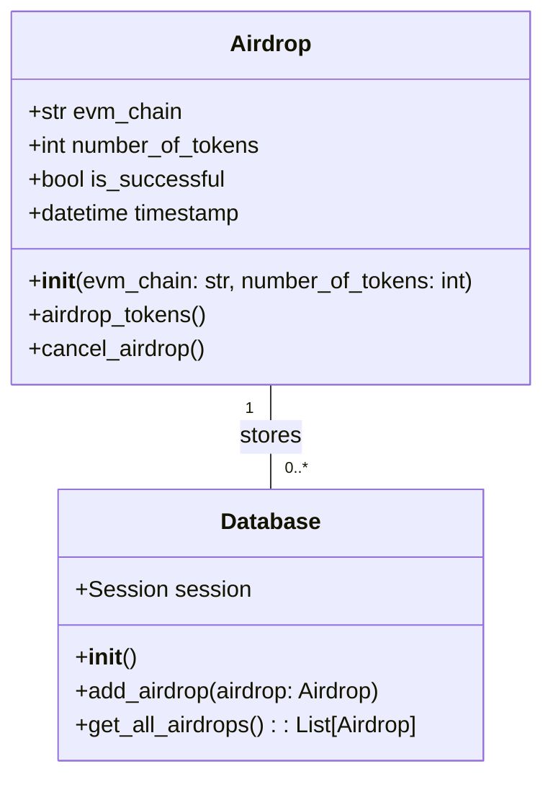
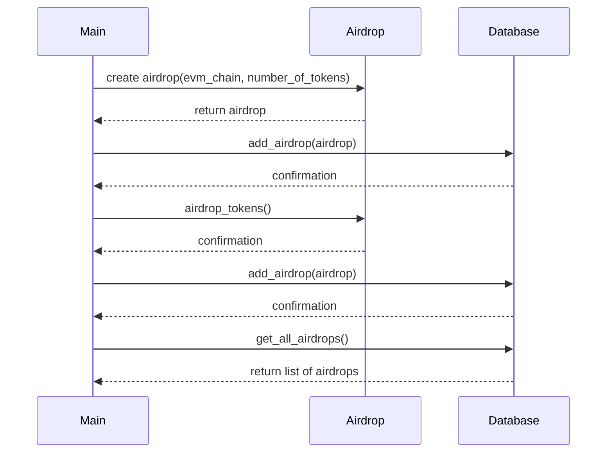

## Implementation approach
The primary challenge in this project is interacting with the Ethereum blockchain. To overcome this, we will use the web3.py library, an open-source Python library for Ethereum. It allows us to connect to local or remote Ethereum nodes using HTTP, IPC, or WebSocket.

We will create a CLI using the argparse library, which makes it easy to write user-friendly command-line interfaces. The argparse module also automatically generates help and usage messages and issues errors when users give the program invalid arguments.

For storing the history of airdrops, we will use SQLite database with the help of SQLAlchemy ORM for easy and efficient data manipulation. SQLAlchemy is a SQL toolkit and Object-Relational Mapping (ORM) system for Python, which provides a full suite of well-known enterprise-level persistence patterns.

## Python package name
```python
"evm_airdrop_cli"
```

## File list
```python
[
    "main.py",
    "airdrop.py",
    "database.py",
    "models.py"
]
```

## Data structures and interface definitions


## Program call flow


## Anything UNCLEAR
The requirement is clear. However, the actual implementation might require additional libraries or tools for interacting with specific EVM chains or for handling specific token types.